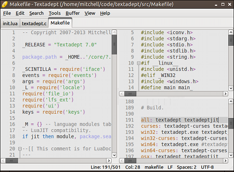

# Introduction

## Overview

Textadept is a fast, minimalist, and ridiculously extensible cross-platform text
editor for programmers. Written in a combination of C and [Lua][] and
relentlessly optimized for speed and minimalism over the years, Textadept is an
ideal editor for programmers who want endless extensibility without sacrificing
speed or succumbing to code bloat and featuritis.

[Lua]: http://lua.org

### Fast

Textadept is _fast_. It starts up instantly and has a very responsive user
interface. Even though the editor is mostly written in Lua, Lua is one of the
fastest scripting languages available. With the optional [LuaJIT][] version,
Textadept is faster than ever before.

[LuaJIT]: http://luajit.org

### Minimalist

Textadept is minimalist. Not only is this apparent in its appearance, but the
editor's C core was designed to never exceed 2000 lines of code and its Lua
extension code is capped at 4000 lines. After more than 5 years of development,
Textadept has maintained the same amount of code since its inception while
evolving into a vastly superior editor.

### Ridiculously Extensible

Textadept is ridiculously extensible. It was designed to be that way from the
very beginning. The features came later. Most of Textadept's internals use Lua,
from syntax highlighting to opening and saving files to searching and replacing
and more. Textadept gives you complete control over the entire application using
Lua. You can do everything from moving the caret to changing menus and key
commands on-the-fly to handling core events. The possibilities are limitless.

## Manual Notation

This manual uses notation that is worth clarifying.

Directories and file paths are represented like this: */path/to/dir/* and
*/path/to/file*. (On Windows machines, '/' and '\' can be used interchangeably
as directory separators.) Any relative paths, paths that do not begin with '/'
or "C:\", are relative to the location of Textadept. *~/* is denoted as the
user's home directory. On Windows machines this is the value of the "USERHOME"
environment variable, typically *C:\Users\username\\* or
*C:\Documents and Settings\username\\*. On Linux, BSD, and Mac OSX machines
it is the value of "$HOME", typically */home/username/* and */Users/username/*
respectively.

Key bindings are represented like this: `Ctrl+N`. They are not case sensitive.
`Ctrl+N` means the "N" key is pressed with only the "Control" modifier key being
held down, not the "Shift" modifier key. `Ctrl+Shift+N` means the "N" key is
pressed with both "Control" and "Shift" modifiers held down. The same notation
is applicable to key chains: `Ctrl+N, N` vs. `Ctrl+N, Shift+N`. In the first key
chain, "Control" and "N" are pressed followed by "N" with no modifiers. The
second has "Control" and "N" pressed followed by "Shift" and "N".

When key bindings are mentioned, the Mac OSX and curses equivalents are often
shown in parenthesis. It may be tempting to assume that some Windows/Linux keys
map to Mac OSX's (e.g. `Ctrl` to `⌘`) or curses' (e.g. `Ctrl` to `^`), but this
is not always the case. Please do not view the key equivalents as translations
of one another, but rather as separate entities. This will minimize confusion.
