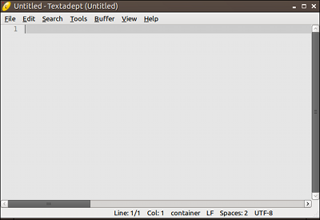

# Introduction

## Overview

Textadept is a fast, minimalist, and ridiculously extensible cross-platform text
editor for programmers. Written in a combination of C and [Lua][] and
relentlessly optimized for speed and minimalism over the years, Textadept is an
ideal editor for programmers who want endless extensibility without sacrificing
speed or succumbing to code bloat and featuritis.

[Lua]: http://lua.org

### Fast

Textadept is _fast_. It starts up instantly and has a very responsive user
interface. Even though the editor consists primarily of Lua, Lua is one of the
fastest scripting languages available. With the optional [LuaJIT][] version,
Textadept runs faster than ever before.

[LuaJIT]: http://luajit.org

### Minimalist

Textadept is minimalist. Not only does its appearance exhibit this, but the
editor's C core pledges to never exceed 2000 lines of code and its Lua extension
code avoids going beyond 4000 lines. After more than 5 years of development,
Textadept contains the same amount of code since its inception while evolving
into a vastly superior editor.

### Ridiculously Extensible

Textadept is ridiculously extensible. Designed to be that way from the very
beginning, the editor's features came later. Most of Textadept's internals use
Lua, from syntax highlighting to opening and saving files to searching and
replacing and more. Textadept gives you complete control over the entire
application using Lua. Everything from moving the caret to changing menus and
key commands on-the-fly to handling core events is possible. Its potential is
vast.

## Manual Notation

The manual represents directories and file paths like this: */path/to/dir/* and
*/path/to/file*. (Windows machines use '/' and '\' interchangeably as directory
separators.) Paths that do not begin with '/' or "C:\", are relative to the
location of Textadept. *~/* denotes the user's home directory. On Windows
machines this is the value of the "USERHOME" environment variable, typically
*C:\Users\username\\* or *C:\Documents and Settings\username\\*. On Linux, BSD,
and Mac OSX machines it is the value of "$HOME", typically */home/username/* and
*/Users/username/*, respectively.

The manual expresses key bindings like this: `Ctrl+N`. They are not case
sensitive. `Ctrl+N` stands for pressing the "N" key while only holding down the
"Control" modifier key, not the "Shift" modifier key. `Ctrl+Shift+N` stands for
pressing the "N" key while holding down both the "Control" and "Shift"
modifiers. The same notation applies to key chains like `Ctrl+N, N` and
`Ctrl+N, Shift+N`. The first key chain represents pressing "Control" and "N"
followed by "N" with no modifiers. The second represents pressing "Control" and
"N" followed by "Shift" and "N".

When mentioning key bindings, the manual often shows the Mac OSX and curses
equivalents in parenthesis. It may be tempting to assume that some Windows/Linux
keys map to Mac OSX's (e.g. `Ctrl` to `⌘`) or curses' (e.g. `Ctrl` to `^`), but
this is not always the case. To minimize confusion, view key equivalents as
separate entities, not as translations of one another.
