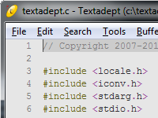

# Installation

## Requirements

In its bid for minimalism, Textadept also needs very little to run. In fact, the
only thing it needs is [GTK+][] >= 2.18 on Linux systems. GTK is already
included in Windows and Mac OSX packages. Textadept also has its own version of
Lua.

The _experimental_ terminal version of Textadept requires [ncurses][]. This
dependency is only necessary if you wish to run Textadept from a terminal.

Notes:

* The Linux binaries provided require GLib >= 2.28 to support single-instance
  functionality. You can compile Textadept with earlier versions of GLib down to
  2.22. For reference, Ubuntu 11.04, Debian Wheezy, Fedora 15, and openSUSE 11.4
  support GLib 2.28 or higher.
* For Win32 and Mac OSX, more than 3/4 of the download and unpackaged
  application sizes are due to GTK+, the cross-platform GUI toolkit Textadept
  uses. Textadept itself is much smaller.

[GTK+]: http://gtk.org
[ncurses]: http://invisible-island.net/ncurses/ncurses.html

### Linux

Most Linux systems already have GTK+ installed. If not, it is probably available
through your package manager. Otherwise, compile and install it from the
[GTK+ website][].

Most Linux systems already have ncurses installed. If not, look for it in your
package manager, or compile and install it from the [ncurses website][]. For
Debian-based distributions like Ubuntu, the package is typically called
`libncursesw5`. Note: you should have a version of ncurses compiled with "wide"
(multibyte) character support installed.

[GTK+ website]: http://www.gtk.org/download-linux.html
[ncurses website]: http://invisible-island.net/ncurses/#download_ncurses

### Mac OSX

No requirements other than Mac OSX 10.5 (Leopard) or higher with an Intel CPU.

### Windows

No requirements.

## Download

Download Textadept from the [project page][]. Select the appropriate package for
your platform.

You can also download an official set of [language-specific modules][], but this
is optional. The list of language modules in the package is contained [here][].
Textadept includes C/C++ and Lua language modules by default.

[project page]: http://foicica.com/textadept
[language-specific modules]: 7_Modules.html#Language.Specific
[here]: http://foicica.com/hg

## Installation

Textadept is designed to be as easy as possible to install by any user. You do
not need to have administrator privileges.

### Linux

Unpack the archive anywhere.

If you downloaded the set of language-specific modules, unpack it where you
unpacked the Textadept archive. The modules will be contained in
`/path/to/textadept_VERSION/modules/`.

### Mac OSX

Unpack the archive and move `Textadept.app` to your user or system
`Applications` directory like any other Mac OSX application. There is also a
`ta` script for launching Textadept from the command line that you can put in
your `PATH`, but this is optional.

If you downloaded the set of language-specific modules, unpack it, right-click
`Textadept.app`, select `Show Package Contents`, navigate to
`Contents/Resources/modules`, and copy the unpacked modules there.

### Windows

Unpack the archive anywhere.

If you downloaded the set of language-specific modules, unpack it where you
unpacked the Textadept archive. The modules will be contained in
`textadept_VERSION\modules\`.

## Running

### Linux

Run Textadept by running `/path/to/textadept_VERSION/textadept` from the
terminal. You can also create a symlink to the executable in your `PATH` (e.g.
`/usr/bin`) or make a GNOME, KDE, XFCE, etc. button or menu launcher.

There is also a `textadeptjit` executable for running Textadept with [LuaJIT][].
Please note there may be [compatibility issues][]. The `textadept` executable is
recommended.

The `textadept-ncurses` and `textadeptjit-ncurses` executables are versions of
Textadept for the terminal.

[LuaJIT]: http://luajit.org
[compatibility issues]: 11_Scripting.html#LuaJIT

#### Problems

It is difficult to provide a single binary that runs on all Linux platforms
since the versions of software installed vary widely from distribution to
distribution. Because the Linux version of Textadept uses the version of GTK+
installed on your system, an error like: `error while loading shared  libraries:
<lib>: cannot open shared object file: No such file or directory` may occur when
trying to run the program. The solution is actually quite painless even though
it requires recompiling Textadept. See the [compiling][] page for more
information.

[compiling]: 12_Compiling.html

### Mac OSX

Run Textadept by double-clicking `Textadept.app`.

`Textadept.app` also contains an executable for running Textadept with
[LuaJIT][]. You can enable it by setting a `TEXTADEPTJIT`
[environment variable](#Environment.Variables) or using `export TEXTADEPTJIT=1`
in the terminal. Please note there may be [compatibility issues][]. The
non-LuaJIT executable is recommended.

[LuaJIT]: http://luajit.org
[compatibility issues]: 11_Scripting.html#LuaJIT

#### Environment Variables

By default, GUI apps like Textadept do not utilize environment variables such as
`PATH` from your shell profile. Therefore, any [modules][] that use programs
contained in `PATH` (e.g. the progams in `/usr/local/bin/`) for run and compile
commands will not be found. The solution is to follow these [instructions][] to
export whichever environment variables you need. At the very least, set `PATH`
to be `$PATH`. You will have to logout and log back in for the changes to take
effect.

[modules]: 7_Modules.html
[instructions]: http://developer.apple.com/library/mac/#qa/qa1067/_index.html

### Windows

Run Textadept by double-clicking `textadept.exe`. You can also create shortcuts
to the executable in your Start Menu, Quick Launch toolbar, Desktop, etc.

There is also a `textadeptjit.exe` executable for running Textadept with
[LuaJIT][]. Please note there may be [compatibility issues][]. The
`textadept.exe` executable is recommended.

[LuaJIT]: http://luajit.org
[compatibility issues]: 11_Scripting.html#LuaJIT

## Single Instance

Textadept is a single-instance application on Linux, BSD, and Mac OSX. This
means that after Textadept is opened, running `textadept file.ext`
(`ta file.ext` on Mac OSX) from the command line or opening a file with
Textadept from a file manager will open `file.ext` in the already open instance
of Textadept. You can override this and open the file in a new instance by
passing a `-f` or `--force` switch to Textadept: `textadept -f file.ext`
(`ta -f file.ext`). When the force switch is not present, files will be opened
in the original Textadept instance, regardless of how many instances are open.

Single instance is not supported on the Windows and terminal versions of
Textadept.

&nbsp;&nbsp;

&nbsp;&nbsp;

