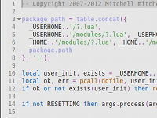
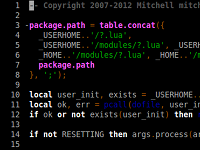

# Themes

Themes customize Textadept's look and feel. The editor's built-in themes are
"light", "dark", and "term". The GUI version uses "light" as its default and the
terminal version uses "term".

&nbsp;&nbsp;

&nbsp;&nbsp;

Each theme is a single Lua file. It contains color and style definitions for
displaying syntactic elements like comments, strings, and keywords in
programming language source files. These [definitions][] apply universally to
all programming language elements, resulting in a single, unified theme. Themes
also set view-related editor properties like caret and selection colors.

Note: The only colors that the terminal version of Textadept recognizes are the
standard black, red, green, yellow, blue, magenta, cyan, white, and bold
variants of those colors. Your terminal emulator's settings determine how to
display these standard colors.

[definitions]: api/lexer.html#Styles.and.Styling

## Setting Themes

Override the default theme in your [*~/.textadept/init.lua*][] using the
[`ui.set_theme()`][] function. For example:

    ui.set_theme('dark')

Either restart Textadept for changes to take effect or type [`reset()`][] in the
[command entry][].

[*~/.textadept/init.lua*]: 08_Preferences.html#User.Init
[`ui.set_theme()`]: api/ui.html#set_theme
[`reset()`]: api/_G.html#reset
[command entry]: 10_Advanced.html#Command.Entry

## Customizing Themes

Like with modules, try to refrain from editing Textadept's default themes.
Instead, put custom or downloaded themes in your *~/.textadept/themes/*
directory. Doing this not only prevents you from overwriting your themes when
you update Textadept, but causes the editor to load your themes instead of the
default ones in *themes/*. For example, having your own *light.lua* theme
results in Textadept loading that theme in place of its own.

There are two ways to go about customizing themes. You can create a new one from
scratch or tweak an existing one. Creating a new one is straightforward -- all
you need to do is define a set of colors and a set of styles. Just follow the
example of existing themes. If instead you want to use an existing theme like
"light" but only change the font face and font size, you have two options: call
[`ui.set_theme()`][] from your *~/.textadept/init.lua* with additional
parameters, or create an abbreviated *~/.textadept/themes/light.lua* using Lua's
`dofile()` function. For example:

    -- File *~/.textadept/init.lua*
    ui.set_theme('light', 'font', 'Monospace', 'fontsize', 12)

    -- File *~/.textadept/themes/light.lua*
    dofile(_HOME..'/themes/light.lua')
    buffer.property['font'] = 'Monospace'
    buffer.property['fontsize'] = 12

Either one loads Textadept's "light" theme, but applies your font preferences.
The same techniques work for tweaking individual theme colors and/or styles, but
managing more changes is probably easier with the latter.

[`ui.set_theme()`]: api/ui.html#set_theme

### Language

Textadept also allows you to customize themes per-language through the
`events.LEXER_LOADED` event. For example, changing the color of functions in
Java from orange to black in the "light" theme looks like this:

    events.connect(events.LEXER_LOADED, function(lang)
      if lang == 'java' then
        buffer.property['style.function'] = 'fore:%(color.light_black)'
      end
    end)

## GUI Theme

There is no way to theme GUI controls like text fields and buttons from within
Textadept. Instead, use [GTK+ Resource files][]. The "GtkWindow" name is
"textadept". For example, style all text fields with a "textadept-entry-style"
like this:

    widget "textadept*GtkEntry*" style "textadept-entry-style"

[GTK+ Resource files]: http://library.gnome.org/devel/gtk/stable/gtk-Resource-Files.html

## Getting Themes

For now, the [wiki][] hosts third-party, user-created themes. The classic
"dark", "light", and "scite" themes prior to version 4.3 are there too.

[wiki]: http://foicica.com/wiki/textadept
