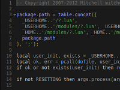

# Themes

Themes customize Textadept's look and feel. The editor's built-in themes are
"light", "dark", and "term". The GUI version uses "light" as its default and the
terminal version uses "term".

&nbsp;&nbsp;

&nbsp;&nbsp;

Each theme is a single Lua file. Putting custom or downloaded themes in your
*~/.textadept/themes/* directory prevents you from overwriting them when you
update Textadept. Also, themes in that directory override any themes in
Textadept's *themes/* directory. This means that if you have your own *light*
theme, Textadept loads that one instead of its own.

Themes contain color definitions and definitions for how to highlight (or
"style") syntactic elements like comments, strings, and keywords in programming
languages. These [definitions][] apply universally to all programming language
elements, resulting in a single, unified theme. Themes also set view-related
editor properties like caret and selection colors.

Note: The only colors that the terminal version of Textadept recognizes are the
standard black, red, green, yellow, blue, magenta, cyan, white, and bold
variants of those colors. Your terminal emulator's settings determine how to
display these standard colors.

[definitions]: api/lexer.html#Styles.and.Styling

## Switch Themes

Switch between or reload themes using `Ctrl+Shift+T` (`⌘⇧T` on Mac OSX | none in
curses). Set that theme to be the default one by putting

    gui.set_theme('name')

somewhere in your [*~/.textadept/init.lua*][].

[*~/.textadept/init.lua*]: 08_Preferences.html#User.Init

## GUI Theme

There is no way to theme GUI controls like text fields and buttons from within
Textadept. Instead, use [GTK+ Resource files][]. The "GtkWindow" name is
"textadept". For example, style all text fields with a "textadept-entry-style"
like this:

    widget "textadept*GtkEntry*" style "textadept-entry-style"

[GTK+ Resource files]: http://library.gnome.org/devel/gtk/stable/gtk-Resource-Files.html

## Getting Themes

For now, the [wiki][] hosts third-party, user-created themes. The classic
"dark", "light", and "scite" themes prior to version 4.3 are there too.

[wiki]: http://foicica.com/wiki/textadept
