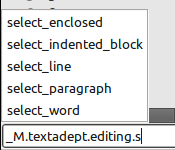

# Advanced

## Command Entry

Access to the Lua state is available through the command entry. Press `Ctrl+E`
(`⌘E` on Mac OSX) to access it. It is useful for debugging, inspecting, and
entering buffer or view commands. If you try to cause instability in Textadept's
Lua state, you might very well succeed so be careful. For more information, see
the [scripting][] page.

Abbreviated commands for the `buffer`, `view` and `gui` are available. So
`buffer:append_text('foo')` can be shortened to `append_text('foo')`. `print()`
redirects to  [`gui.print()`][]. Use `_G.print()` for Lua's `print()`.

[scripting]: 11_Scripting.html
[`gui.print()`]: api/gui.html#print

### Tab Completion

Tab-completion for functions, variables, tables, etc. is available. Press the
`Tab` (`⇥`) key to display a list of available completions. Use the arrow keys
to make a selection and press `Enter` (`↩`) to insert it.

### Extending

You can extend the command entry to do more than enter Lua commands. An
example of this is [incremental search][]. See `modules/textadept/find.lua` for
the implementation.

[incremental search]: api/gui.find.html#find_incremental

## Command Selection

If you did not disable the menu in your [preferences][], then pressing
`Ctrl+Shift+E` (`⌘⇧E` on Mac OSX) brings up the command selection dialog. Typing
part of any command filters the list with spaces being wildcards. This is an
easy way to run commands without navigating the menus, using the mouse, or
remembering key commands. It is also useful for looking up particular key
commands quickly.

[preferences]: 9_Preferences.html#User.Init

## Shell Commands and Filtering Text

Sometimes it is easier to use an existing shell command to manipulate text
instead of using the command entry. An example would be sorting all text in a
buffer (or a selection). You could do the following from the command entry:

    ls={}; for l in buffer:get_text():gmatch('[^\n]+') do ls[#ls+1]=l end;
    table.sort(ls); buffer:set_text(table.concat(ls, '\n'))

A simpler way would be to press `Ctrl+|` (`⌘|` on Mac OSX), enter the shell
command `sort`, and hit `Enter` (`↩`).

The standard input (stdin) for shell commands is determined as follows:

* If text is selected and spans multiple lines, all text on the lines containing
  the selection is used. However, if the end of the selection is at the
  beginning of a line, only the EOL (end of line) characters from the previous
  line are included as input. The rest of the line is excluded.
* If text is selected and spans a single line, only the selected text is used.
* If no text is selected, the entire buffer is used.

The input text is replaced with the standard output (stdout) of the command.

## File Encoding

Textadept represents all characters and strings internally as UTF-8. You will
not notice any difference for working with files containing ASCII text since
UTF-8 is compatible with it. Textadept can also detect ISO-8859-1 and MacRoman,
the primary encodings used on Windows and Mac OSX respectively. Files with more
exotic encodings may not be detected properly, if at all. You can change the
list of encodings Textadept tries to detect via [`io.try_encodings`][].

It is recommended to use UTF-8 encoded files because UTF-8 is very well
supported by other text editors and operating systems. You can change the file's
encoding via the `Buffer -> Encoding` menu. Textadept saves new files as UTF-8
by default.

[`io.try_encodings`]: api/io.html#try_encodings
