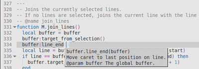

# Scripting

Textadept is entirely scriptable with Lua. In fact, the editor is mostly written
in Lua. As a result, Textadept has superb support for editing Lua code. Syntax
autocomplete and API documentation is available for many Textadept objects as
well as Lua's standard libraries. The [`lua` module][] also has more tools for
working with Lua code.

&nbsp;&nbsp;&nbsp;&nbsp;

[`lua` module]: api/_M.lua.html

## LuaDoc and Examples

Textadept's API is heavily documented. The [API documentation][] is the ultimate
resource on scripting Textadept. There are of course abundant scripting examples
since the editor is written primarily in Lua.

[API documentation]: api/index.html

### Generating LuaDoc

You can generate Textadept-like API documentation for your own modules using the
*doc/markdowndoc.lua* [LuaDoc][] module (you must have [Discount][] installed):

    luadoc -d . [-t template_dir] --doclet _HOME/doc/markdowndoc [module(s)]

where `_HOME` is where Textadept is installed and `template_dir` is an optional
template directory that contains two Markdown files: *.header.md* and
*.footer.md*. (See *doc/.header.md* and *doc/.footer.md* for examples.) An
*api/* directory containing the API documentation HTML files is created in the
current directory.

[LuaDoc]: http://keplerproject.github.com/luadoc/
[Discount]: http://www.pell.portland.or.us/~orc/Code/discount/

## Lua Configuration

[Lua 5.2][] is built into Textadept. It has the same configuration (*luaconf.h*)
as vanilla Lua with the following exceptions:

* `TA_LUA_PATH` and `TA_LUA_CPATH` are the environment variable used in place of
  the usual `LUA_PATH` and `LUA_CPATH`.
* `LUA_ROOT` is "/usr/" in Linux systems instead of "/usr/local/".
* `LUA_PATH` and `LUA_CPATH` do not have "./?.lua" and "./?.so" in them.
* All compatibility flags for Lua 5.1 are turned off. (`LUA_COMPAT_UNPACK`,
  `LUA_COMPAT_LOADERS`, `LUA_COMPAT_LOG10`, `LUA_COMPAT_LOADSTRING`,
  `LUA_COMPAT_MAXN`, and `LUA_COMPAT_MODULE`.)

[Lua 5.2]: http://www.lua.org/manual/5.2/

### LuaJIT

Even though Textadept can be run with [LuaJIT][], LuaJIT is based on Lua 5.1 and
is not fully compatible with Lua 5.2. Therefore, modules and scripts should be
written to be compatible with both versions. There is a compatibility layer in
*core/compat.lua*. Please see it for more information.

[LuaJIT]: http://luajit.org

## Scintilla

The editing component used by Textadept is [Scintilla][]. The [buffer][] part of
Textadept's API is derived from the [Scintilla API][] so any C/C++ code using
Scintilla calls can be ported to Lua without too much trouble.

[Scintilla]: http://scintilla.org
[buffer]: api/buffer.html
[Scintilla API]: http://scintilla.org/ScintillaDoc.html

## Textadept Structure

Because Textadept is mostly written in Lua, its Lua scripts have to be stored in
an organized folder structure.

### Core

Textadept's core Lua modules are contained in *core/*. These are absolutely
necessary in order for the application to run. They are responsible for
Textadept's Lua to C interface, event structure, file interactions, and
localization.

### Lexers

Lexer modules are responsible for the syntax highlighting of source code. They
are located in *lexers/*.

### Modules

Generic and language-specific modules for editing text and source code are
contained in *modules/*.

### Themes

Built-in themes to customize the look and behavior of Textadept are located in
*themes/*.

### User

User preferences, Lua modules, themes, and user-data are contained in the
*~/.textadept/* folder. This folder may contain *lexers/*, *modules/*, and
*themes/* sub-directories.

### GTK+

The *etc/*, *lib/*, and *share/* directories are used by GTK+ and only appear in
the Win32 and Mac OSX packages.
