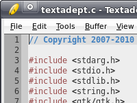
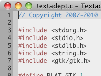
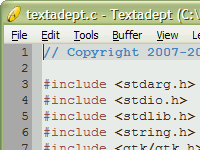

# Installation

## Requirements

In its bid for minimalism, Textadept also needs very little to run. In fact, the
only thing it needs is [GTK+ 2.0](http://gtk.org) >= 2.16 on Linux systems. GTK
is already included in Windows and Mac OSX packages. Textadept also has it's own
version of Lua.

Note: for Win32 and Mac OSX, more than 3/4 of the download and unpackaged
application sizes are due to GTK, the cross-platform GUI toolkit Textadept uses.
Textadept itself is much smaller.

#### Linux

Most Linux systems already have GTK+ installed. If not, it is probably available
through your package manager. Otherwise, compile and install it from the
[GTK+ website](http://www.gtk.org/download-linux.html).

#### Mac OSX

Prior to 3.5, the GTK+ [Mac OSX Framework][GTK-OSX] was required. Newer versions
are all-inclusive and do not require anything.

[GTK-OSX]: http://code.google.com/p/textadept/downloads/detail?name=Gtk-Framework-2.14.3-2-test1.dmg

Note that Textadept is designed for Intel Leopard+ Macs.

#### Windows

Prior to 3.5, the [GTK+ 2.0 Runtime](http://sourceforge.net/projects/gtk-win/)
was required. Newer versions are all-inclusive and do not require anything.

## Download

Download Textadept from the [project page](http://textadept.googlecode.com/).
Select the appropriate package for your platform.

## Installation

Textadept was designed to be as easy as possible to install by any user. You do
not need to have administrator privileges.

#### Linux

Unpack the archive anywhere. Run Textadept by running
`/path/to/textadept_VERSION/textadept` from the terminal. You can also create a
symlink to the executable in your `PATH` (e.g. `/usr/bin`) or make a GNOME, KDE,
XFCE, etc. button or menu launcher.

#### Mac OSX

Unpack the archive and move `textadept.app` to your user or system
`Applications` directory like any other Mac OSX application. Run Textadept by
double-clicking `textadept.app`.

#### Windows

Unpack the archive anywhere. Run Textadept by double-clicking `textadept.exe`.
You can also create shortcuts to the executable in your Start Menu, Quick Launch
toolbar, Desktop, etc.

&nbsp;&nbsp;

&nbsp;&nbsp;

