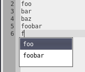
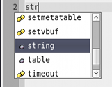
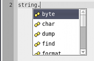
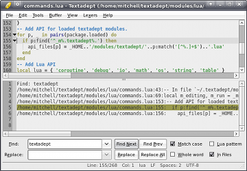
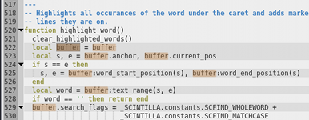

# Adept Editing

## Key Commands

Textadept is entirely keyboard-driven. See the comprehensive list of key
commands in the [appendix](14_Appendix.html#key_bindings). Key commands can be
modified in your [preferences](9_Preferences.html#key_commands).

## Character Autopairing

Usually, quote (`'`, `"`) and brace (`(`, `[`, `{`) characters go together in
pairs. By default, Textadept automatically inserts the complement character when
the first is typed. Similarly, the complement is deleted when you press
`Backspace` (`⌫`) over the first. See the
[preferences](9_Preferences.html#module_settings) page if you would like to
disable this.

## Word Completion

Textadept provides buffer-based word completion. Start typing a word, press
`Ctrl+Return` (`^⎋` on Mac OSX), and a list of suggested completions based on
words in the current document is provided. Continuing to type changes the
suggestion. Press `Return` (`↩`) to complete the selected word.

## Adeptsense

Textadept has the capability to autocomplete symbols for programming languages
and display API documentation. Lua is of course supported extremely well and
other languages have basic support with the help of
[ctags](http://ctags.sf.net). Symbol completion is available by pressing
`Ctrl+Space` (`⌥⎋` on Mac OSX). Documentation for symbols is available with
`Ctrl+H` (`^H`).

&nbsp;&nbsp;&nbsp;&nbsp;

For more information on adding adeptsense support for another language, see
the [LuaDoc](../modules/_m.textadept.adeptsense.html).

## Find and Replace

`Ctrl+F` (`⌘F` on Mac OSX) brings up the Find/Replace dialog. In addition to
offering the usual find and replace, Textadept allows you to find with [Lua
patterns](14_Appendix.html#lua_patterns) and replace with Lua captures and even
Lua code! For example: replacing all `(%w+)` with `%(string.upper('%1'))`
capitalizes all words in the buffer. Lua captures (`%n`) are only available from
a Lua pattern search, but embedded Lua code enclosed in `%()` is always allowed.

Note the `Ctrl+G`, `Ctrl+Shift+G`, `Ctrl+Alt+R`, `Ctrl+Alt+Shift+R` key commands
for find next, find previous, replace, and replace all (`⌘G`, `⌘⇧G`, `^R`, `^⇧R`
respectively on Mac OSX) only work when the Find/Replace dialog is hidden. When
it is visible, use the button mnemonics: `Alt+N`, `Alt+P`, `Alt+R`, and `Alt+A`
(`⌘N`, `⌘P`, `⌘R`, `⌘A`) for English locale.

#### Find in Files

`Ctrl+Shift+F` brings up Find in Files (`⌘⇧F` on Mac OSX) and will prompt for a
directory to search. The results are displayed in a new buffer. Double-clicking
a search result jumps to it in the file. You can also use the `Ctrl+Alt+G` and
`Ctrl+Alt+Shift+G` (`^⌘G` and `^⌘⇧G` on Mac OSX) key commands. Replace in Files
is not supported. You will have to `Find in Files` first, and then `Replace All`
for each file a result is found in. The `Match Case`, `Whole Word`, and
`Lua pattern` flags still apply.

#### Find Incremental

You can start an incremental search by pressing `Ctrl+Alt+F` (`^⌘F` on Mac OSX).
Incremental search searches the buffer as you type. Only the `Match Case` option
is recognized.

#### Replace in Selection

By default, `Replace All` replaces all text in the buffer. If you want to
replace all text in just a portion of the buffer, select a block of text and
then `Replace All`.

## Indentation

#### Increase or Decrease Indent Level

The amount of indentation for a selected set of lines is increased by pressing
`Tab` (`⇥`) and decreased by pressing `Shift+Tab` (`⇧⇥`). Using these key
sequences when no selection is present does not have the same effect.

#### Change Indent Size

The indent size is usually set by a [language-specific
module](7_Modules.html#buffer_properties) or the [theme](8_Themes.html#buffer).
Textadept shows what it is using for indentation in the document statusbar.

#### Using Tabs Instead of Spaces

You can use tabs instead of the default spaces by pressing `Ctrl+Alt+Shift+T`
(`^⇧T` on Mac OSX) or using the `Buffer -> Toggle Use Tabs` menu. Textadept
shows what it is using for indentation in the document statusbar.

The default option is usually set by a [language-specific
module](7_Modules.html#buffer_properties) or the [theme](8_Themes.html#buffer).

#### Converting Between Tabs and Spaces

Use the `Edit -> Convert Indentation` menu to convert indentation. If the buffer
is using tabs, all spaces are converted to tabs. If the buffer is using spaces,
all tabs are converted to spaces.

## Selecting Text

#### Rectangular Selection

Holding `Alt+Shift` (`⌥⇧` on Mac OSX) and pressing the arrow keys enables
rectangular selections to be made. Start typing to type on each line.

&nbsp;&nbsp;&nbsp;&nbsp;

#### Multiple Selection

Clicking the mouse at a point in the buffer while holding `Control` places an
additional caret at that point. Clicking and dragging while holding `Control`
creates multiple selections. Start typing to enter text at each selection.

This is currently unavailable on Mac OSX.

#### Selecting Entities

Textadept allows you to select many different entities from the caret. For
example, `Ctrl+"` (`^"` on Mac OSX) selects all characters in a `""` sequence.
Typing `Ctrl++` (`^+`) as a follow-up selects the double-quotes too. See the
`Edit -> Select In...` menu for available entities and their key commands.

## Enclosing Text

As a complement to selecting entities, you can enclose text as entities. The
`Edit -> Selection -> Enclose In...` menu contains all available entities and
their key commands.

If no text is selected, the word to the left of the caret is enclosed.

## Word Highlight

All occurrences of a given word are highlighted by putting the caret over the
word and pressing `Ctrl+Alt+Shift+H` (`⌘⇧H` on Mac OSX). This is useful to show
occurrences of a variable name in source code.

## Editing Modes

#### Virtual Space

Virtual space (freehand) mode is enabled and disabled with `Ctrl+Alt+Shift+V`
(`^⇧V` in Mac OSX). When enabled, caret movement is not restricted by line
endings.

#### Overwrite

Overwrite mode is enabled and disabled with the `Insert` key. When enabled,
characters in the buffer will be overwritten instead of inserted as you type.
The caret also changes to an underline when in overwrite mode.
